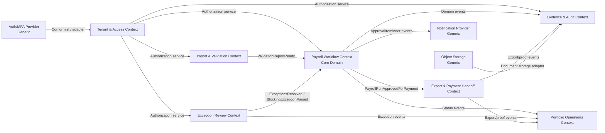
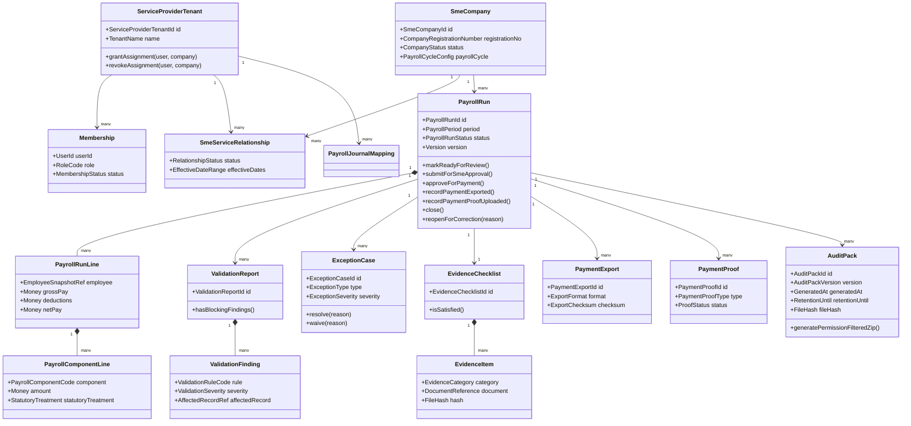

# Domain Model — SME Payroll Approval SaaS

**Status:** Draft architecture artifact  
**Baseline source:** `docs/baseline/ACCEPTED-DEFAULT-BASELINE.md`  
**Scope:** MVP domain model for multi-company payroll verification, exception review, SME approval, payment export/proof, and audit evidence.

---

## 1. Domain Framing

SME Payroll Approval SaaS is a **payroll verification, approval, evidence, and export workflow** for service providers and SMEs. The MVP does **not** own the full ERP, accounting ledger, bank reconciliation, or statutory payroll engine.

The core product value is controlling the monthly payroll approval lifecycle across many SME companies:

1. import or prepare draft payroll;
2. validate payroll and source evidence;
3. review OT/exceptions;
4. obtain SME approval;
5. export payment/accounting artifacts;
6. retain proof and an immutable audit timeline.

---

## 2. Strategic DDD Overview

### Core Domain

#### Payroll Run Approval Workflow

This is the differentiating domain. It coordinates payroll readiness, exceptions, internal review, SME approval, export, payment proof, reopening, and closure across multiple companies.

Why core:

- It is the product wedge and primary user workflow.
- It creates portfolio-level control for service providers.
- It reduces payroll approval risk and missing evidence.
- It defines the language, state machine, and audit trail that competitors would need to replicate.

### Supporting Subdomains

#### Payroll Import and Validation

Responsible for receiving imported/manual payroll data, normalizing it into payroll run records, detecting issues, and generating validation findings. Important, but not the final competitive core unless the product later becomes a statutory payroll engine.

#### OT and Exception Review

Responsible for overtime, unusual payroll components, missing evidence, variance checks, and reviewer resolution. High-value supporting subdomain closely tied to the core workflow.

#### Evidence and Audit Pack

Responsible for evidence checklist rules, document attachments, file hashes, structured append-only audit event timeline, and reproducible versioned ZIP evidence pack generation. Audit events capture safe metadata and version/checksum references, not raw full salary or bank values (`DEC-2026-05-17-2341-structured-append-only-audit-timeline`); evidence pack generation is permission-filtered, hashed, and retained for 7 years by default (`DEC-2026-05-18-0033-versioned-permissioned-evidence-pack`).

#### Payment and Export Handoff

Responsible for payment listing, payment export file records, payroll journal preview/export, statutory summary export artifacts, and payment proof upload. It is a handoff model, not a banking/payment execution model.

#### Tenancy, Assignment, and Authorization

Responsible for platform account, service-provider tenant, SME company workspace, role, assignment, and permission policies. It protects all domain operations.

#### Notification and Task Follow-Up

Responsible for reminders, blocked status alerts, approval requests, and evidence request notifications.

### Generic Subdomains

These should be bought, reused, or kept thin behind adapters:

- Authentication, MFA, password reset, session management.
- Email/SMS/WhatsApp delivery.
- Object storage and antivirus scanning.
- PDF/XLSX/CSV generation libraries.
- Payment gateway or bank file format libraries, if added later.
- Generic analytics/telemetry.
- Support ticketing and billing/subscription management.

---

## 3. Bounded Contexts

### 3.1 Tenant and Access Context

**Purpose:** Defines who can operate on which SME company and which sensitive payroll fields/actions they may access.

**Primary language:** Platform Account, Service Provider Tenant, SME Company Workspace, Membership, Company Assignment, Role Code, Fixed Role Bundle, Permission Key, Permission Matrix, Role Grant, Permission Policy, Sensitive Field Access, Break-Glass Access.

**Key model:**

- `ServiceProviderTenant`
- `SmeCompany`
- `SmeServiceRelationship`
- `Membership`
- `CompanyAssignment`
- `RoleCode`
- `FixedRoleBundle`
- `PermissionKey`
- `PermissionMatrix`
- `RoleGrant`
- `CompanyScopedGrant`
- `PermissionPolicy`

**Integration style:** Open host service for authorization decisions. Other contexts ask: “Can actor X perform action Y on resource Z within company C?” MVP authorization evaluates stable permission keys derived from fixed role bundles; application code must not rely only on role-name checks (`DEC-2026-05-17-2331-fixed-mvp-rbac-permission-matrix`).

**Authorization invariants:**

- Every permission grant is scoped to one company unless it is a platform-support permission.
- Platform-support access to payroll data requires reason capture and an audit event.
- If a permission key is not granted by the matrix, the action is denied by default.
- `CustomRoleDefinition` is intentionally deferred; the MVP model must not expose tenant-defined roles but must avoid hardcoding permissions in a way that blocks future custom role bundles.
- Sensitive salary, deduction, net pay, bank account, identity, payment proof, and evidence fields are default-masked; reveal/export/download requires explicit permission-key evaluation and audit logging (`DEC-2026-05-17-2337-strict-sensitive-data-masking`).

### 3.2 Payroll Workflow Context — Core

**Purpose:** Owns the payroll run lifecycle and enforces the approval state machine.

**Primary language:** Payroll Run, Payroll Period, Draft, Validation Issues, Ready for Review, Exception Review, Pending SME Approval, Approved for Payment, Payment Exported, Payment Proof Uploaded, Closed, Reopened, Correction Required.

**Key model:**

- `PayrollRun` aggregate root
- `PayrollRunLine`
- `PayrollRunSummary`
- `ApprovalRequest`
- `ApprovalReadinessSummary`
- `ReviewDecision`
- `ReturnReasonCategory`
- `OwnerReturnComment`
- `WorkflowTransition`
- `PayrollRunStatus`

**MVP summary totals:** employee count, basic pay total, allowances total, overtime total, gross pay total, deductions total, net pay total, payment-ready total, and rows with issues count. Sensitive salary/payment totals are masked according to authorization policy.

**Owner approval readiness summary:** per `DEC-2026-05-17-2306-owner-readiness-summary`, the submitted approval view must bind to a payroll run version and expose only decision-ready facts: employee count, gross/net/payment-ready totals, validation status, blocking/warning counts, OT/exception status, evidence readiness, submitted by/time, run version, and stale-snapshot blocking state.

**Integration style:** Publishes domain events consumed by Evidence, Export, Notification, and Portfolio Dashboard contexts.

### 3.3 Payroll Import and Validation Context

**Purpose:** Converts source input into normalized payroll run data and findings, using the accepted practical payroll/payment readiness checklist for MVP.

**Primary language:** Import Batch, Source File, Import Mapping, Validation Finding, Blocking Issue, Warning, Validation Rule, Payment Readiness, Payroll Component, Employee Payroll Snapshot.

**Key model:**

- `ImportBatch`
- `ImportPreview`
- `ImportPreviewRow`
- `SourceFile`
- `ImportMapping`
- `ImportTemplate`
- `TemplateColumn`
- `ValidationReport`
- `ValidationFinding`
- `ValidationRuleSet`

**MVP import template columns:** `employee_identifier`, `employee_name`, `ic_or_passport_last4`, `department`, `basic_pay`, `allowances`, `deductions`, `overtime_amount`, `net_pay`, `bank_name`, `bank_account`, `payment_reference`, `remarks`.

**MVP import commitment rule:** Uploaded files first create an `ImportPreview` with row-level validation findings; payroll rows are committed to a Draft `PayrollRun` only after explicit confirmation and only when no blocking errors remain.

**MVP validation checklist:** required employee identifier, required employee name, duplicate employee identifier, valid numeric pay fields, non-negative pay values, gross pay consistency, net pay consistency, missing bank name/account when net pay > 0, rows missing payment reference when payment export is expected, and zero blocking issue count before submission.

**Integration style:** Anti-corruption layer for spreadsheet formats and future external payroll/HR systems. Emits validation results into Payroll Workflow.

### 3.4 Exception Review Context

**Purpose:** Manages OT, variance, missing evidence, unsupported employee/category, and unusual component exceptions. MVP OT review uses a practical SME review set rather than a full attendance/payroll-rule engine.

**Primary language:** Exception Case, OT Exception, Exception Type, Severity, Resolution, Reviewer Note, Required Action, Exception Queue, Evidence Reference.

**Key model:**

- `ExceptionCase`
- `ExceptionRule`
- `ExceptionResolution`
- `OvertimeEvidenceRef`

**MVP OT exception types:** excessive OT above configured threshold, missing OT evidence, public holiday/rest day mismatch, employee not OT-eligible, unusual multiplier, and manual override.

**Integration style:** Customer/supplier relationship with Payroll Workflow; Payroll Workflow cannot advance beyond exception review while blocking exception cases remain unresolved unless a blocking case is explicitly escalated to SME approval.

### 3.5 Evidence and Audit Context

**Purpose:** Maintains immutable evidence timeline and generates reproducible audit packs.

**Primary language:** Evidence Item, Evidence Checklist, Audit Timeline, Evidence Pack, Audit Pack, Pack Version, Document Index, File Hash, Retention Until, Snapshot, Proof.

**Key model:**

- `EvidenceChecklist`
- `EvidenceItem`
- `AuditTimelineEntry`
- `AuditPack`
- `AuditPackVersion`
- `GeneratedArtifactRef`
- `DocumentIndexEntry`
- `RetentionUntil`
- `DocumentReference`

**Integration style:** Subscribes to domain events from Payroll Workflow, Import, Exception Review, and Export. It should append evidence/timeline facts, not mutate workflow state directly. Evidence pack generation queries versioned artifacts through application services, applies authorization/sensitive-field policy before packaging, stores the pack record/checksum, and emits audit events for generation/download.

### 3.6 Export and Payment Handoff Context

**Purpose:** Produces export artifacts after approval and tracks proof upload.

**Primary language:** Payment Export, Payment Listing, Export Artifact, Statutory Summary, Payroll Journal Mapping, Mapping Bucket Key, Account Code, Cost Centre, Payroll Journal Preview, Payroll Journal Export, Export Template, Payment Proof.

**Key model:**

- `PaymentExport`
- `ExportArtifact`
- `PaymentExportFormatVersion`
- `ExportFileChecksum`
- `PayrollJournalMapping`
- `PayrollJournalMappingBucket`
- `AccountCode`
- `CostCentreRef`
- `PayrollJournalPreview`
- `PaymentProof`
- `PaymentProofMetadata`
- `PaymentProofChecksum`

**MVP payment export:** per `DEC-2026-05-17-2313-controlled-generic-payment-csv`, generates a controlled generic CSV from an Approved for Payment payroll run version with `employee_identifier`, `employee_name`, `bank_name`, `bank_account`, `payment_reference`, `net_pay_amount`, `currency`, and `pay_date`; records exporter, timestamp, run version, row count, exported total, checksum, and format version.

**MVP payment proof:** per `DEC-2026-05-17-2317-controlled-payment-proof-upload`, captures controlled proof evidence with proof type, payment date, payment reference/note, uploader, timestamp, file name/type/size/checksum, linked payroll run version, linked payment export record if available, authorization-controlled download, and audit logging. It does not assert bank-side payment success.

**MVP payroll journal mapping:** per `DEC-2026-05-18-0039-practical-journal-mapping-with-future-coa-path`, stores company-level account code mappings for stable payroll bucket keys: `salary_expense`, `allowance_expense`, `overtime_expense`, `employer_statutory_expense`, `employee_deduction_payable`, `epf_kwsp_payable`, `socso_perkeso_payable`, `eis_payable`, `pcb_mtd_payable`, `net_salary_payable`, `cash_bank_clearing`, `rounding_adjustment`, and optional `department_or_cost_centre`. Required mapping gaps block journal preview/export. The mapping model must separate stable bucket keys from account code labels so future full COA/accounting-system integration can map richer external account records without changing payroll journal generation.

**Integration style:** Consumes `PayrollRunApprovedForPayment`; emits `PaymentExported`, `PaymentProofUploaded`.

### 3.7 Portfolio Operations Context

**Purpose:** Gives service-provider users a multi-company control tower.

**Primary language:** Portfolio Status, Blocker, Pending Approver, Payroll Month, Overdue, Risk, Readiness.

**Key model:** Read models/projections, not rich write aggregates:

- `CompanyPayrollStatusProjection`
- `PortfolioDashboardProjection`
- `OverdueApprovalProjection`

**Integration style:** CQRS-style projection from workflow and exception events.

### 3.6 Evidence and Audit Context

**Purpose:** Owns append-only audit events, evidence file references, checksums, and reproducible evidence pack generation.

**Primary language:** Audit Event, Event Type, Actor, Resource Reference, Payroll Run Version, Metadata Snapshot, Checksum, Evidence Pack, Pack Version, Retention Until, Document Index, Denied Attempt, Sensitive Reveal, Export Event.

**Key model:**

- `AuditEvent`
- `AuditEventType`
- `AuditActor`
- `AuditResourceRef`
- `AuditMetadata`
- `EvidenceFileRef`
- `EvidencePack`
- `EvidencePackRecord`
- `EvidencePackContentPolicy`
- `RetentionUntil`

**MVP evidence pack rule:** Evidence packs are versioned ZIP files generated only from approved/payable payroll run states. They contain a PDF summary plus CSV/JSON attachments, apply the same sensitive-field permission policy as screens/exports, store file hash/checksum and source artifact/version references, and default `retention_until` to 7 years after generation.

**MVP audit rule:** Audit events are append-only. Corrections and supersessions add new events. Events must store safe metadata, masked values, checksums, counts, reason codes, and version IDs instead of raw full salary, bank account, identity, or unrestricted evidence contents.

**Integration style:** Other contexts publish lifecycle, sensitive access, export/download, and denied-attempt events. Evidence and Audit stores the immutable timeline and serves chronological audit history to authorized users.

---

## 4. Context Map

---

## 5. Ubiquitous Language

Terms are scoped to the bounded context where they are used. Avoid leaking external spreadsheet, payroll software, bank, or accounting-system terms into the core model without translation.

### Tenant and Access Language

- **Platform Account:** The SaaS operator boundary.
- **Service Provider Tenant:** The commercial workspace for a firm managing payroll/admin work for SME companies. Use service-provider-neutral language; do not hard-code “CoSec” into the core domain.
- **SME Company Workspace:** The operational and data ownership boundary for one SME company.
- **SME Service Relationship:** The active or historical relationship between a service provider and SME company.
- **Membership:** A user’s affiliation with a tenant or SME company.
- **Assignment:** Explicit permission for a service-provider user to work on an SME company.
- **Sensitive Field Access:** Permission to view or export salary, bank, identity, and statutory identifiers.
- **Break-Glass Access:** Time-limited support access requiring reason, ticket, expiry, and audit trail.

### Payroll Workflow Language

- **Payroll Run:** One payroll cycle for one SME company and one payroll period. It is the aggregate that moves through the approval lifecycle.
- **Payroll Period:** The user-facing month/year label plus explicit `period_start`, `period_end`, and `pay_date` covered by a payroll run.
- **Draft / Imported:** Payroll data exists but is not yet clean enough for review.
- **Validation Issues:** The run has blocking validation findings requiring correction.
- **Ready for Review:** Required validation checks have passed; reviewers can assess exceptions.
- **OT / Exception Review:** Reviewers resolve OT, variance, unsupported category, missing evidence, or unusual component exceptions.
- **Pending SME Approval:** Payroll has passed provider-side review and awaits authorized SME approval.
- **Approved for Payment:** SME has approved payroll for payment/export. Payroll amounts become locked except via controlled reopen/correction.
- **Payment Exported:** Payment listing/file/report has been generated after approval.
- **Payment Proof Uploaded:** Proof of salary/statutory payment or placeholder evidence has been attached.
- **Closed / Archived:** Payroll run is complete, evidence pack is retained, and routine changes are blocked.
- **Reopened / Correction Required:** Controlled exception state for correcting an approved/exported/closed run.

### Import and Validation Language

- **Import Batch:** A single import attempt from file/manual entry/API.
- **Source File:** Original uploaded input file retained as evidence.
- **Import Mapping:** Column-to-domain mapping used to interpret a source file.
- **Validation Finding:** A detected issue, warning, or informational message.
- **Blocking Issue:** A validation finding that prevents state progression.
- **Payroll Component:** A classified pay/deduction item such as salary, allowance, overtime, bonus, unpaid leave, claim reimbursement, employee deduction, employer contribution.
- **Employee Payroll Snapshot:** Payroll-relevant employee attributes captured for this run, including category and statutory treatment flags.

### Exception Review Language

- **Exception Case:** A review item requiring human action before payroll can proceed.
- **OT Exception:** Exception related to overtime eligibility, amount/threshold, multiplier, missing evidence, public holiday/rest day mismatch, or manual override.
- **Severity:** Risk level used to prioritize review: info, warning, blocking, critical.
- **Resolution:** Reviewer decision and reason that closes or escalates an exception.
- **Reviewer Note:** Human explanation retained in the audit timeline.

### Evidence and Audit Language

- **Evidence Checklist:** Required and conditional evidence rules for a payroll run.
- **Evidence Item:** Document, generated artifact, comment, approval record, or external proof attached to a payroll run.
- **Audit Timeline:** Append-only sequence of domain facts and sensitive actions.
- **Audit Pack:** Reproducible export package for a payroll run, including documents, approvals, exports, and timeline.
- **Document Reference:** Metadata and storage reference for a file, including hash/checksum and classification.
- **Calculation Snapshot:** Frozen summary of draft/final payroll values and rules/mappings used.

### Export and Payment Language

- **Payment Export:** Generated salary payment listing, bank file, or payment report artifact.
- **Export Artifact:** Any generated file/report retained as evidence.
- **Payroll Journal Preview:** Accountant-ready journal view derived from payroll totals and mapping rules; not a ledger posting.
- **Statutory Summary:** Export-ready summary of statutory amounts. MVP may verify/report rather than guarantee final statutory submission.
- **Payment Proof:** Uploaded evidence that salary/statutory payment has been made or scheduled.

---

## 6. Tactical Domain Model

### 6.1 Aggregate: PayrollRun — Core Aggregate Root

**Identity:** `PayrollRunId`

**Purpose:** Enforces lifecycle, locking, approval, and correction invariants for one SME company’s payroll period.

**Entities inside aggregate:**

- `PayrollRunLine` — employee-level payroll summary for the run.
- `PayrollComponentLine` — component-level amounts within an employee line.
- `ApprovalRequest` — request sent to SME approver.
- `ReviewDecision` — provider/SME decision record.
- `WorkflowTransition` — state transition record, with actor/reason.

**Value objects:**

- `PayrollRunId`
- `SmeCompanyId`
- `ServiceProviderTenantId`
- `PayrollPeriod`
- `PayDate`
- `PayrollRunStatus`
- `Money`
- `CurrencyCode`
- `PayrollComponentCode`
- `StatutoryTreatment`
- `EmployeeSnapshotRef`
- `ActorRef`
- `ApprovalDecision`
- `ApprovalStatementVersion`
- `AccessContext`
- `TransitionReason`
- `Version`

**Key commands:**

- `CreateDraftPayrollRun`
- `ImportPayrollData`
- `RecordValidationReport`
- `MarkReadyForReview`
- `StartExceptionReview`
- `ResolveExceptionReview`
- `SubmitForSmeApproval`
- `ApprovePayrollForPayment`
- `RejectPayrollApproval`
- `RecordPaymentExported`
- `RecordPaymentProofUploaded`
- `ClosePayrollRun`
- `ReopenForCorrection`
- `ApplyCorrection`

**Core invariants:**

- A payroll run belongs to exactly one SME company and one payroll period.
- A payroll period stores a display month/year label plus explicit `period_start`, `period_end`, and `pay_date`; monthly payroll defaults to the calendar month but the stored dates are authoritative.
- Only one active non-void payroll run should exist per SME company/payroll period/payroll cycle.
- Payroll amounts cannot be exported before SME approval.
- `SubmitForSmeApproval` requires approval-readiness: latest validation report has zero blocking issues, blocking OT exceptions are resolved or explicitly escalated, required pre-approval evidence placeholders/checklist items are present or formally waived, payroll totals snapshot is generated, sensitive salary/bank access is checked server-side, and submission audit event is recorded.
- `ApprovePayrollForPayment` requires an authorized SME approver, `PendingSmeApproval` status, unchanged run version since submission, visible locked totals/exception/evidence summary, and accepted approval statement.
- `ViewApprovalReadinessSummary` requires authorization to the company/payroll run and must mask or deny sensitive salary/payment fields according to role policy; the summary must be bound to the submitted run version (`DEC-2026-05-17-2306-owner-readiness-summary`).
- `ReturnPayrollForCorrection` requires an authorized SME approver, `PendingSmeApproval` status, a structured reason category, and required owner comment; it invalidates the submitted approval snapshot and records `DEC-2026-05-17-2258-owner-return-structured-correction` scope rules.
- Payroll lines cannot be changed after `ReadyForReview`, `OtExceptionReview`, or `PendingSmeApproval` except through the controlled return/reopen correction path.
- Every state transition must include actor, timestamp, prior state, next state, command, and reason where required.
- Sensitive data access is not authorized by the aggregate; it must be checked by Tenant and Access before loading/displaying sensitive fields and before creating owner submission snapshots.
- `GeneratePaymentExport` requires `ApprovedForPayment` status, payment export permission, approved run version binding, and audit capture of checksum/totals/row count/format version (`DEC-2026-05-17-2313-controlled-generic-payment-csv`).
- `UploadPaymentProof` requires Approved for Payment or Payment Exported status, payment/proof permission, accepted file type/size, required proof metadata, checksum, linked payroll run version, and audit logging (`DEC-2026-05-17-2317-controlled-payment-proof-upload`).
- Closing requires either payment proof uploaded or an explicit authorized proof waiver/placeholder, depending on configured evidence policy.
- Reopening requires reason, authority, and audit event; previous approved/exported artifacts remain retained and are superseded, not deleted.

### 6.2 Aggregate: ImportBatch

**Identity:** `ImportBatchId`

**Purpose:** Tracks source import, mapping, parsing, normalization, and import validation results.

**Entities:**

- `SourceFile`
- `ParsedRow`
- `ImportError`
- `ImportMappingVersion`

**Value objects:**

- `FileHash`
- `FileName`
- `MimeType`
- `ImportSourceType`
- `ColumnMapping`
- `RowNumber`
- `ValidationSeverity`

**Invariants:**

- Original source file is retained once used to create/replace payroll data.
- Import mapping version is recorded for reproducibility.
- Failed imports cannot overwrite an existing payroll run.
- Bulk overwrite requires maker-checker or privileged authorization if enabled.

### 6.3 Aggregate: ValidationReport

**Identity:** `ValidationReportId`

**Purpose:** Captures validation findings for a payroll run and determines whether blocking issues exist.

**Entities:**

- `ValidationFinding`

**Value objects:**

- `ValidationRuleCode`
- `ValidationSeverity`
- `AffectedRecordRef`
- `FindingMessageCode`
- `ValidationRuleCode`
- `ValidationReportVersion`

**Invariants:**

- A report is immutable after being attached to a payroll run state transition.
- Blocking findings prevent `ReadyForReview` and submission for SME approval.
- The latest validation report determines readiness; prior reports remain retained for audit traceability.
- Findings reference domain concepts, not raw spreadsheet cells only.
- Full statutory contribution/PCB validation is outside the MVP rule set unless a pilot explicitly adds it.

### 6.4 Aggregate: ExceptionCase

**Identity:** `ExceptionCaseId`

**Purpose:** Represents one human-reviewable payroll exception.

**Entities:**

- `ExceptionResolution`
- `ReviewerNote`
- `EvidenceRequirementRef`

**Value objects:**

- `ExceptionType`
- `ExceptionSeverity`
- `PayrollImpactAmount`
- `RequiredAction`
- `ResolutionReason`
- `EvidenceReference`
- `ReviewerDecision`

**Invariants:**

- Blocking exception cases must be resolved before SME approval submission unless explicitly escalated to SME approval.
- Resolution requires actor, timestamp, decision, note, and reason.
- MVP OT rules are deterministic review flags, not statutory/legal interpretation or full attendance/shift-rule calculation.
- If an exception is waived, waiver reason and authority are mandatory.
- Critical exceptions may require reviewer approval separate from processor action.

### 6.5 Aggregate: EvidenceChecklist

**Identity:** `EvidenceChecklistId`

**Purpose:** Defines required, conditional, and optional evidence for a payroll run.

**Entities:**

- `EvidenceRequirement`
- `EvidenceItemLink`

**Value objects:**

- `EvidenceRuleCode`
- `EvidenceRequirementStatus`
- `EvidenceCategory`
- `DocumentReference`
- `FileHash`

**Invariants:**

- Mandatory evidence must be satisfied before close unless waived by authorized role.
- Conditional evidence rules evaluate against payroll run facts, e.g. “OT approval required if overtime exists.”
- Evidence item links are append-only; replacement creates a superseding link.

### 6.6 Aggregate: AuditPack

**Identity:** `AuditPackId`

**Purpose:** Reproducible packaged evidence for one payroll run, accepted by `DEC-2026-05-18-0033-versioned-permissioned-evidence-pack`.

**Entities:**

- `AuditPackSection`
- `DocumentIndexEntry`
- `GeneratedArtifactRef`

**Value objects:**

- `AuditPackVersion`
- `GeneratedAt`
- `GeneratedBy`
- `FileHash`
- `PackScope`
- `SensitivityMarker`
- `RetentionUntil`
- `SourceArtifactRef`

**Invariants:**

- A generated audit pack must reference exact versions of artifacts/documents included.
- Generation is allowed only for Approved for Payment, Payment Exported, Payment Proof Uploaded, or Closed / Archived payroll runs.
- Pack content must be filtered by server-side permission and sensitive-field policy before ZIP/PDF/CSV/JSON artifacts are written.
- Regenerating creates a new version; prior pack versions remain available subject to retention.
- Pack metadata stores file hash/checksum, generator, timestamp, sensitivity markers, source references, and `retention_until = generated_at + 7 years`.
- Audit pack generation, denied generation, and download must be logged as sensitive evidence/export events.

### 6.7 Aggregate: PayrollJournalMapping

**Identity:** `PayrollJournalMappingId`

**Purpose:** Company-scoped payroll accounting handoff configuration for journal preview/export, accepted by `DEC-2026-05-18-0039-practical-journal-mapping-with-future-coa-path`.

**Entities:**

- `PayrollJournalMappingLine`
- `MappingChangeAuditRef`

**Value objects:**

- `MappingBucketKey`
- `AccountCode`
- `AccountLabel`
- `CostCentreRef`
- `MappingStatus`

**Invariants:**

- Required payroll bucket keys must be mapped before journal preview/export can proceed.
- Mapping bucket keys are stable product/domain keys; account codes and labels are company-specific configuration values.
- Only authorized finance/owner roles can create or change mappings.
- Mapping changes append audit events and must not silently rewrite historical journal export records.
- Future full COA integration may reference external account IDs, but MVP does not manage the full chart of accounts.

### 6.8 Aggregate: PayrollJournalPreview

**Identity:** `PayrollJournalPreviewId`

**Purpose:** Version-bound accounting handoff preview generated from payroll totals and company journal mappings, accepted by `DEC-2026-05-18-0050-controlled-balanced-journal-preview`.

**Entities:**

- `JournalPreviewLine`
- `JournalPreviewBalanceCheck`
- `JournalPreviewAccessAuditRef`

**Value objects:**

- `DebitCreditSide`
- `JournalLineAmount`
- `PayrollRunVersionRef`
- `MappingBucketKey`
- `JournalImbalanceAmount`

**Invariants:**

- Preview lines must be generated from a specific payroll run version and company-scoped mapping set.
- Required mappings must be active and valid before preview/export can proceed.
- Total debit amount must equal total credit amount before export is allowed.
- Refreshing preview recalculates from the latest valid totals for the current payroll run state; historical exported previews keep their original run version reference.
- Sensitive line amounts and payroll/payment details must be filtered through the server-side sensitive-field policy before display or export.
- MVP journal preview does not allow manual journal adjustments, posting period management, reversal/accrual entries, multi-currency accounting, entity consolidation, or direct GL posting.

### 6.9 Aggregate: PayrollJournalExport

**Identity:** `PayrollJournalExportId`

**Purpose:** Auditable CSV artifact generated from a locked valid payroll journal preview, accepted by `DEC-2026-05-18-0055-controlled-journal-csv-export`.

**Entities:**

- `JournalExportArtifact`
- `JournalExportAttempt`

**Value objects:**

- `JournalExportFormatVersion`
- `JournalExportChecksum`
- `JournalPreviewVersionRef`
- `JournalExportLine`

**Invariants:**

- Export can only be generated from a valid, balanced, non-stale `PayrollJournalPreview`.
- Export artifact must reference payroll run ID/version and preview ID/version.
- Stale, invalid, missing-mapping, or imbalanced previews block export and create denied/blocked audit events where applicable.
- Export lines and generated files follow sensitive-field policy before file creation.
- MVP exports generic CSV only; package-specific formats and direct accounting API sync are deferred.

### 6.10 Aggregate: PaymentExport

**Identity:** `PaymentExportId`

**Purpose:** Tracks generated payment/export artifacts from an approved payroll run.

**Entities:**

- `ExportArtifact`
- `ExportAttempt`

**Value objects:**

- `ExportFormat`
- `ExportTemplateVersion`
- `ExportChecksum`
- `PaymentBatchReference`

**Invariants:**

- Export can only be generated from an `ApprovedForPayment` or later payroll run.
- Export artifact must store the payroll run version used.
- Regeneration after correction creates a new export version; old exports are retained and marked superseded where applicable.

### 6.11 Aggregate: PaymentProof

**Identity:** `PaymentProofId`

**Purpose:** Captures proof that payroll/statutory payment was made, scheduled, or externally handled.

**Entities:**

- `ProofDocument`
- `ProofReview`

**Value objects:**

- `PaymentProofType`
- `PaymentReference`
- `ProofStatus`
- `FileHash`

**Invariants:**

- Proof must reference a payment export or approved payroll run.
- Proof upload after closure requires reopen or append-only post-close evidence policy.
- Proof containing bank details is sensitive and must be access logged.

### 6.12 Aggregate: ServiceProviderTenant

**Identity:** `ServiceProviderTenantId`

**Purpose:** Commercial and operational workspace for a service provider.

**Entities:**

- `Membership`
- `RoleGrant`
- `CompanyAssignment`

**Value objects:**

- `TenantName`
- `MembershipStatus`
- `RoleCode`
- `PermissionCode`

**Invariants:**

- Non-admin service-provider users can only access explicitly assigned SME companies.
- Privileged role changes must be audited.
- Disabled memberships cannot approve, export, or view sensitive data.

### 6.13 Aggregate: SmeCompany

**Identity:** `SmeCompanyId`

**Purpose:** SME company workspace and data owner boundary.

**Entities:**

- `SmeServiceRelationship`
- `CompanyUserMembership`
- `PayrollCalendar`

**Value objects:**

- `CompanyRegistrationNumber`
- `CompanyStatus`
- `PayrollCycleConfig`
- `RetentionPolicy`

**Invariants:**

- Payroll runs require active SME company status and active service relationship.
- Transfers/termination preserve historical payroll audit access according to retention rules.
- Company offboarding must support export before deletion/termination workflow.

---

## 7. Domain Events

Events are past-tense facts. They should be written via an outbox in the same transaction as aggregate changes where implementation requires integration reliability.

### Payroll Workflow Events

- `PayrollRunCreated`
- `PayrollDataImported`
- `PayrollValidationCompleted`
- `PayrollValidationIssuesFound`
- `PayrollRunMarkedReadyForReview`
- `PayrollExceptionReviewStarted`
- `PayrollExceptionReviewCompleted`
- `PayrollSubmittedForSmeApproval`
- `PayrollApprovalRejected`
- `PayrollRunApprovedForPayment`
- `PayrollPaymentExportRecorded`
- `PayrollPaymentProofUploaded`
- `PayrollRunClosed`
- `PayrollRunReopenedForCorrection`
- `PayrollCorrectionApplied`
- `PayrollRunArchived`

### Import and Validation Events

- `ImportBatchUploaded`
- `ImportBatchParsed`
- `ImportBatchRejected`
- `ImportBatchAppliedToPayrollRun`
- `ValidationReportGenerated`
- `BlockingValidationIssueRaised`

### Exception Review Events

- `ExceptionCaseRaised`
- `ExceptionCaseAssigned`
- `ExceptionCaseResolved`
- `ExceptionCaseWaived`
- `BlockingExceptionCleared`

### Evidence and Audit Events

- `EvidenceRequirementCreated`
- `EvidenceItemAttached`
- `EvidenceItemSuperseded`
- `EvidenceChecklistSatisfied`
- `AuditPackGenerated`
- `SensitivePayrollDataViewed`
- `SensitivePayrollDataExported`

### Export and Payment Events

- `PaymentExportGenerated`
- `PaymentExportSuperseded`
- `PayrollJournalPreviewGenerated`
- `StatutorySummaryExported`
- `PaymentProofSubmitted`
- `PaymentProofAccepted`
- `PaymentProofRejected`

### Access and Tenant Events

- `ServiceProviderTenantCreated`
- `SmeCompanyWorkspaceCreated`
- `SmeServiceRelationshipActivated`
- `CompanyAssignmentGranted`
- `CompanyAssignmentRevoked`
- `SensitiveFieldPermissionGranted`
- `SensitiveFieldPermissionRevoked`
- `BreakGlassAccessStarted`
- `BreakGlassAccessEnded`

---

## 8. Cross-Cutting Invariants

### Tenancy and Authorization

- Every command must carry authenticated actor, tenant context, SME company scope, and correlation ID.
- Every payroll/evidence/export record must include `sme_company_id`.
- Every service-provider action must be authorized against the user’s tenant membership and SME assignment.
- Sensitive salary, bank, statutory, and identity data access must be separately permissioned and logged.

### Auditability

- Workflow transitions are append-only facts.
- Corrections do not silently overwrite approved facts; they create new versions/events.
- Generated artifacts record source run version, template version, mapping version, timestamp, actor, and checksum.
- Audit timeline must be reproducible and exportable.

### Payroll Lifecycle

- Payroll cannot move to SME approval with blocking validation findings or unresolved blocking exceptions.
- Payroll cannot be payment-exported before SME approval.
- Payroll cannot close without required evidence or authorized waiver.
- Reopen/correction always requires reason and authority.

### MVP Boundary

- Payroll journal export is an accounting handoff artifact, not a GL posting.
- Statutory summaries are readiness/export artifacts unless a future statutory engine is explicitly implemented.
- Payment proof records external payment evidence; the MVP does not need to execute bank transfers.

---

## 9. Mermaid Domain Model Diagram

---

## 10. Design Notes and Open Questions

### Accepted Defaults Reflected

- Company-neutral service-provider terminology is used.
- SME company is the data owner boundary.
- MVP emphasizes verification/approval/evidence, not full ERP/accounting/statutory engine.
- Corrections are append-only and audit-visible.
- Payroll state machine is explicit and controlled.

### Open Questions for Later Discovery

- Which pilot roles can waive mandatory evidence?
- Is internal maker-checker mandatory or configurable per service-provider tenant?
- Which payment export formats are required for first pilot?
- Which statutory readiness checks are hard blockers versus warnings?
- What retention period and deletion process should legal counsel approve?
