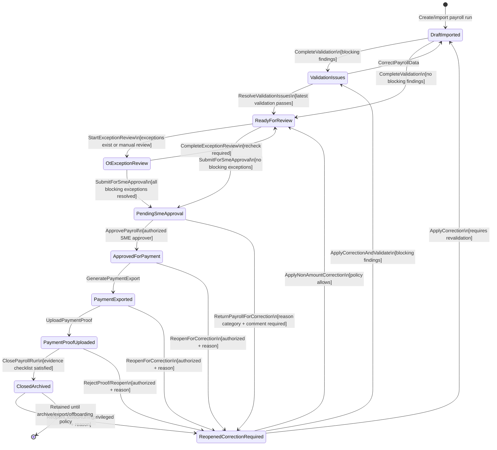
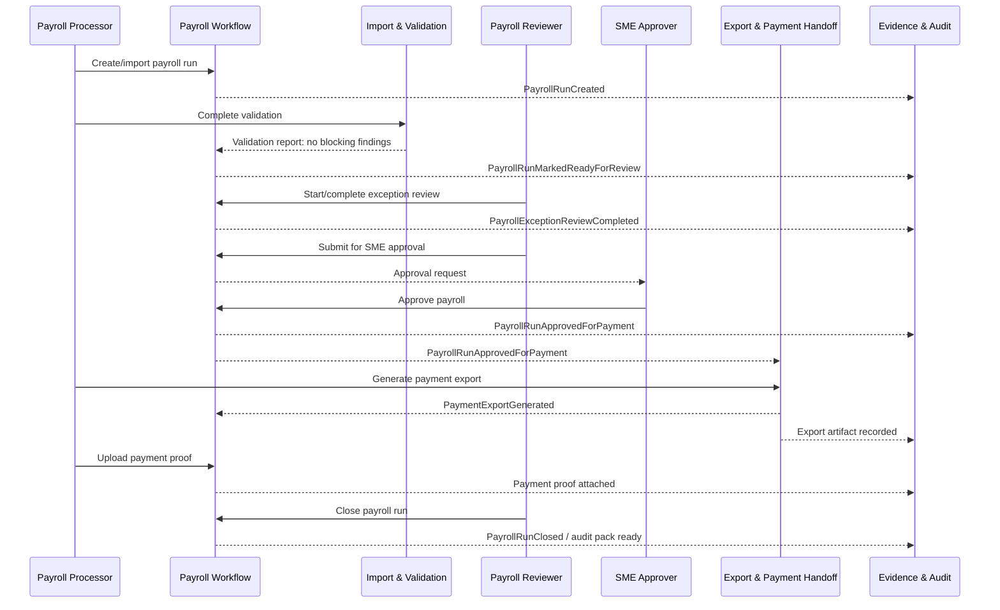

# Payroll Workflow State Machine — SME Payroll Approval SaaS

**Status:** Draft architecture artifact  
**Baseline source:** `docs/baseline/ACCEPTED-DEFAULT-BASELINE.md`  
**Scope:** MVP payroll run lifecycle for multi-company payroll verification, OT/exception review, SME approval, payment export/proof, closure, and controlled correction.

---

## 1. State Machine Purpose

The payroll workflow state machine protects the product’s core promise: every payroll run has a clear status, owner, next action, approval record, export trail, payment proof, and audit history.

It intentionally models a **workflow and evidence system**, not a full ERP/accounting/statutory payroll engine.

### Bounded Context and Aggregate Alignment

- **Owning bounded context:** Payroll Workflow Context.
- **Owning aggregate:** `PayrollRun` aggregate root.
- **Collaborating bounded contexts:** Import and Validation, Exception Review, Evidence and Audit, Export and Payment Handoff, Tenant and Access, Portfolio Operations.
- **Consistency boundary:** a state transition mutates one `PayrollRun` aggregate version and appends transition/audit events in the same transaction. Collaborating contexts react through domain events and projections.
- **Do not model as:** generic task status, accounting period close, bank payment execution, or statutory filing status. Those may be related artifacts, but the lifecycle below is the payroll approval workflow lifecycle.

---

## 2. Payroll Run States

### `DraftImported`

Payroll run exists for a company/period. Data may have been manually entered or imported, but validation is not yet complete.

Manual add/edit rule:

- Payroll rows may be added or edited only in `DraftImported`.
- Once the run leaves `DraftImported`, row edits are blocked unless the run is returned/reopened to `DraftImported` through a controlled correction transition.
- Correction edits after a return/reopen require audit metadata such as actor, timestamp, changed fields, and reason where applicable.

Typical actors:

- Service-provider payroll processor
- SME staff uploading inputs
- System import job

Entry examples:

- new payroll run created;
- source file imported;
- reopened correction has been applied and the run needs revalidation.

Exit condition:

- validation report generated.

### `ValidationIssues`

Validation found one or more blocking issues.

Examples:

- missing employee identifier;
- negative or invalid amount;
- payroll component not mapped;
- missing bank/payment details where required;
- unsupported employee category;
- statutory readiness check failed;
- source file row cannot be normalized.

Exit condition:

- all blocking validation issues corrected or waived by an authorized role.

### `ReadyForReview`

Payroll data has no blocking validation issues and is ready for provider-side review.

Exit condition:

- no exception review required, or exception review started.

### `OtExceptionReview`

The payroll run is under OT/exception review.

Examples:

- OT eligibility mismatch;
- public holiday/rest day multiplier issue;
- unusually high overtime;
- missing attendance evidence;
- high variance from previous period;
- bonus/commission/claim requires approval evidence.

Exit condition:

- all blocking exception cases resolved or waived.

### `PendingSmeApproval`

Provider-side review is complete and the payroll run awaits authorized SME approval.

Allowed SME decisions:

- approve for payment;
- return for correction with a structured reason category and required comment.

Exit condition:

- authorized SME approver approves the unchanged submitted run version after accepting the approval statement, or returns/requests correction with reason category and comment.

### `ApprovedForPayment`

SME has approved a specific submitted payroll run version with an explicit approval statement. Payroll amounts, approval statement version, and review facts are locked for normal editing. Payment/export artifacts may now be generated.

Exit condition:

- payment export generated, or run reopened for correction.

### `PaymentExported`

Payment listing/file/report and/or payroll journal/statutory summaries have been exported after approval.

Exit condition:

- payment proof uploaded, or run reopened for correction.

### `PaymentProofUploaded`

Payment proof or approved placeholder has been attached.

Exit condition:

- required evidence checklist satisfied and run closed, or proof rejected/correction required.

### `ClosedArchived`

Payroll run is complete and retained as audit evidence. Routine edits are blocked.

Exit condition:

- controlled reopen for correction only.

### `ReopenedCorrectionRequired`

Controlled exception state for correcting a run after SME approval, export, proof upload, or closure.

Rules:

- reason is mandatory;
- authorization is mandatory;
- for owner return from Pending SME Approval, reason must be one MVP return reason category plus a required owner comment (`DEC-2026-05-17-2258-owner-return-structured-correction`);
- previous submitted approval snapshots, approvals, exports, and proofs are retained/superseded, not deleted;
- corrected version increments the payroll run version and must pass validation/review/approval again according to policy.

---

## 3. Transition Table

### Main Path

- `DraftImported` → `ValidationIssues`
  - Trigger: `CompleteValidation`
  - Guard: validation report has blocking findings
  - Actor: system validation job or payroll processor
  - Event: `PayrollValidationIssuesFound`

- `DraftImported` → `ReadyForReview`
  - Trigger: `CompleteValidation`
  - Guard: validation report has no blocking findings
  - Actor: system validation job or payroll processor
  - Event: `PayrollRunMarkedReadyForReview`

- `ValidationIssues` → `DraftImported`
  - Trigger: `CorrectPayrollData`
  - Guard: correction submitted or source data replaced
  - Actor: payroll processor or authorized SME/provider user
  - Event: `PayrollCorrectionApplied`

- `ValidationIssues` → `ReadyForReview`
  - Trigger: `ResolveValidationIssues`
  - Guard: all blocking findings resolved or waived; latest validation report passes
  - Actor: payroll processor/reviewer
  - Event: `PayrollRunMarkedReadyForReview`

- `ReadyForReview` → `OtExceptionReview`
  - Trigger: `StartExceptionReview`
  - Guard: exception rules found reviewable cases, or reviewer starts review manually
  - Actor: payroll reviewer/manager or system
  - Event: `PayrollExceptionReviewStarted`

- `ReadyForReview` → `PendingSmeApproval`
  - Trigger: `SubmitForSmeApproval`
  - Guard: latest validation report has zero blocking issues; blocking OT/exceptions resolved or explicitly escalated; required pre-approval evidence placeholders/checklist items present or formally waived; payroll totals snapshot generated; sensitive salary/bank access checked server-side; submission audit event recorded
  - Actor: payroll reviewer/manager
  - Event: `PayrollSubmittedForSmeApproval`

- `OtExceptionReview` → `ReadyForReview`
  - Trigger: `CompleteExceptionReview`
  - Guard: all blocking exceptions resolved/waived; reviewer decides another readiness check is needed
  - Actor: payroll reviewer/manager
  - Event: `PayrollExceptionReviewCompleted`

- `OtExceptionReview` → `PendingSmeApproval`
  - Trigger: `SubmitForSmeApproval`
  - Guard: latest validation report has zero blocking issues; blocking OT/exceptions resolved or explicitly escalated; required pre-approval evidence placeholders/checklist items present or formally waived; payroll totals snapshot generated; sensitive salary/bank access checked server-side; submission audit event recorded
  - Actor: payroll reviewer/manager
  - Event: `PayrollSubmittedForSmeApproval`

- `PendingSmeApproval` → `ApprovedForPayment`
  - Trigger: `ApprovePayroll`
  - Guard: actor is authorized SME approver; payroll run is Pending SME Approval; run version unchanged since submission; locked totals/exception/evidence summary displayed; approval statement accepted
  - Actor: SME owner/admin/authorized approver
  - Event: `PayrollRunApprovedForPayment`

- `PendingSmeApproval` → `ReopenedCorrectionRequired`
  - Trigger: `ReturnPayrollForCorrection`
  - Guard: actor is authorized SME approver; run is Pending SME Approval; return reason category selected; owner comment provided; current submitted version recorded for invalidation/supersession
  - Actor: SME owner/admin/authorized approver
  - Event: `PayrollReturnedForCorrection`

- `ApprovedForPayment` → `PaymentExported`
  - Trigger: `GeneratePaymentExport`
  - Guard: actor has payment export permission; run is Approved for Payment; export is generated from the approved run version; generic CSV format version is valid; checksum/totals/row count can be recorded (`DEC-2026-05-17-2313-controlled-generic-payment-csv`)
  - Actor: payment/journal user, payroll manager/reviewer, or authorized processor
  - Event: `PaymentExportGenerated`

- `PaymentExported` → `PaymentProofUploaded`
  - Trigger: `UploadPaymentProof`
  - Guard: proof document/reference provided; file passes storage/security checks
  - Actor: SME admin, service-provider user, or authorized finance user
  - Event: `PaymentProofSubmitted`

- `PaymentProofUploaded` → `ClosedArchived`
  - Trigger: `ClosePayrollRun`
  - Guard: evidence checklist satisfied or waivers recorded; proof accepted or placeholder policy allows closure
  - Actor: payroll manager/reviewer or authorized SME admin
  - Event: `PayrollRunClosed`

### Controlled Correction Path

- `ApprovedForPayment` → `ReopenedCorrectionRequired`
  - Trigger: `ReopenForCorrection`
  - Guard: authorized actor; reason code/comment required; audit warning acknowledged
  - Actor: payroll manager, SME approver, or privileged admin according to policy
  - Event: `PayrollRunReopenedForCorrection`

- `PaymentExported` → `ReopenedCorrectionRequired`
  - Trigger: `ReopenForCorrection`
  - Guard: authorized actor; reason required; export supersession required if corrected
  - Actor: payroll manager, SME approver, or privileged admin
  - Event: `PayrollRunReopenedForCorrection`

- `PaymentProofUploaded` → `ReopenedCorrectionRequired`
  - Trigger: `RejectProof` or `ReopenForCorrection`
  - Guard: reason required; proof rejection/correction logged
  - Actor: payroll manager, SME approver, or privileged admin
  - Event: `PayrollRunReopenedForCorrection`

- `ClosedArchived` → `ReopenedCorrectionRequired`
  - Trigger: `ReopenClosedRun`
  - Guard: privileged authorization; reason required; closed-run correction policy allows reopen
  - Actor: payroll manager/admin plus SME approver if configured
  - Event: `PayrollRunReopenedForCorrection`

- `ReopenedCorrectionRequired` → `DraftImported`
  - Trigger: `ApplyCorrection`
  - Guard: correction touches payroll data/import data and requires revalidation
  - Actor: payroll processor or authorized provider user
  - Event: `PayrollCorrectionApplied`

- `ReopenedCorrectionRequired` → `ValidationIssues`
  - Trigger: `ApplyCorrectionAndValidate`
  - Guard: correction applied but blocking validation remains
  - Actor: payroll processor/system
  - Event: `PayrollValidationIssuesFound`

- `ReopenedCorrectionRequired` → `ReadyForReview`
  - Trigger: `ApplyNonAmountCorrection`
  - Guard: correction does not change approved payroll amounts and validation remains valid; policy allows review restart without full import
  - Actor: payroll manager/reviewer
  - Event: `PayrollCorrectionApplied`

### Optional / Policy-Driven Transitions

- `ApprovedForPayment` → `ClosedArchived`
  - Trigger: `CloseWithoutPaymentExport`
  - Guard: configured company policy allows no payment export; required evidence/waiver exists
  - Event: `PayrollRunClosed`

- `PaymentExported` → `ClosedArchived`
  - Trigger: `CloseWithProofWaiver`
  - Guard: proof placeholder/waiver authorized; evidence checklist satisfied
  - Event: `PayrollRunClosed`

These optional paths should be disabled by default unless pilot workflow confirms them.

---

## 4. Mermaid State Diagram

---

## 5. Transition Guards and Authorization Rules

### Universal Guards

Every transition requires:

- authenticated actor or trusted system actor;
- resolved `ServiceProviderTenantId` and `SmeCompanyId` where applicable;
- authorization check against role, assignment, company status, and action policy;
- optimistic concurrency check against current payroll run version;
- audit metadata: actor, timestamp, command, prior state, next state, correlation ID;
- reason when the transition is exceptional, destructive, privileged, or correction-related.

### State-Specific Guards

#### Validation Guards

- Validation report must reference the current payroll run version.
- Blocking findings prevent progression to review/approval.
- Waived validation findings require authority and reason.

#### Review Guards

- Blocking exception cases prevent progression to SME approval.
- Exception waivers require reason and role authority.
- Critical exception resolution may require maker-checker if configured.

#### Approval Guards

- SME approval requires an authorized SME-side approver, not only a service-provider processor.
- Approval must bind to a specific payroll run version and approval summary.
- Approval readiness summary must be decision-ready and bound to the submitted payroll run version (`DEC-2026-05-17-2306-owner-readiness-summary`).
- If payroll data changes after submission, prior SME approval request is invalidated and approval is blocked until the latest submitted snapshot is viewed.
- Owner return-for-correction requires the run to be Pending SME Approval, an authorized SME approver, one MVP return reason category, a required owner comment, and audit capture of the prior submitted version (`DEC-2026-05-17-2258-owner-return-structured-correction`).

#### Export Guards

- Payment export requires `ApprovedForPayment` state for the first export.
- Export requires sensitive payment export permission and audit logging.
- Export must be generated from the approved payroll run version and the controlled generic CSV format (`DEC-2026-05-17-2313-controlled-generic-payment-csv`).
- Export must record exporter, timestamp, run version, row count, exported total, format version, and checksum.
- Unauthorized or pre-approval export attempts are blocked and audit-logged.

#### Proof Guards

- Payment proof must reference approved/exported payroll facts.
- Proof file must pass storage/security checks.
- Proof may be accepted, rejected, or superseded; it is not silently replaced.

#### Closure Guards

- Mandatory evidence checklist items must be satisfied or waived.
- Closure must create final timeline entry.
- Closed payroll run blocks routine edits and exports are controlled by read/export permissions.

#### Reopen Guards

- Reopen requires reason code/comment.
- Reopen requires elevated authority or configured maker-checker.
- Reopen after export/proof/closure marks existing generated artifacts as current or superseded according to correction impact.
- Reopened payroll cannot skip back to closed without re-satisfying applicable guards.

---

## 6. Payroll Run Invariants

### Identity and Uniqueness

- A payroll run belongs to exactly one SME company.
- A payroll run covers exactly one payroll period/cycle.
- A payroll run displays a month/year label but stores explicit `period_start`, `period_end`, and `pay_date`; the explicit date range is authoritative for audit and uniqueness.
- Only one active non-void payroll run should exist for the same company/period/cycle.

### Data Integrity

- Money values use fixed-precision integer minor units and currency; never floating point.
- Payroll component lines must have valid component classification and statutory treatment flags.
- Generated summaries, exports, and audit packs must store source version references.

### Workflow Integrity

- No transition may skip required validation before review/approval.
- No unresolved blocking exception may reach SME approval.
- No payment export may occur before SME approval.
- No normal payroll amount edit is allowed after approval.
- Corrections after approval require reopen and audit trail.

### Evidence Integrity

- Source files used for payroll must be retained or referenced with hash/checksum.
- Evidence item replacement is append-only and supersedes prior evidence rather than deleting it.
- Audit timeline is append-only.
- Audit pack generation must be reproducible from stored versions.

### Security and Privacy

- Viewing/exporting salary, bank, statutory identifiers, and identity data requires explicit permission.
- Sensitive data access and export are logged.
- Service-provider staff must be assigned to the SME company unless they hold an authorized admin role.
- Platform break-glass access is time-limited, reasoned, and audited.

---

## 7. Domain Commands and Events by Transition

### `CompleteValidation`

Emits one of:

- `PayrollValidationCompleted`
- `PayrollValidationIssuesFound`
- `PayrollRunMarkedReadyForReview`

### `SubmitForSmeApproval`

Emits:

- `PayrollSubmittedForSmeApproval`

Side effects:

- creates approval request;
- notifies SME approver;
- records approval summary/version;
- materializes owner readiness summary fields required by `DEC-2026-05-17-2306-owner-readiness-summary` for the submitted run version.

### `ApprovePayroll`

Emits:

- `PayrollRunApprovedForPayment`

Side effects:

- locks payroll amounts for normal editing;
- records SME approval decision;
- enables payment/export actions;
- updates portfolio dashboard projection.

### `ReturnPayrollForCorrection`

Emits:

- `PayrollReturnedForCorrection`

Side effects:

- records structured return reason category and required owner comment;
- invalidates/supersedes the submitted approval snapshot;
- creates correction work for the payroll operator;
- notifies payroll operator/reviewer;
- logs actor, timestamp, prior submitted run version, reason category, and comment.

### `GeneratePaymentExport`

Emits:

- `PaymentExportGenerated`
- `PayrollPaymentExportRecorded`
- optionally `PayrollJournalPreviewGenerated` or `StatutorySummaryExported`

Side effects:

- stores generated artifact checksum/version;
- stores row count and exported total;
- binds export artifact to approved payroll run version;
- logs sensitive export and denied attempts where applicable;
- updates audit timeline.

### `UploadPaymentProof`

Emits:

- `PaymentProofSubmitted`
- `PayrollPaymentProofUploaded`

Side effects:

- stores proof document reference;
- updates evidence checklist;
- logs sensitive document upload if applicable.

### `ClosePayrollRun`

Emits:

- `PayrollRunClosed`
- optionally `AuditPackGenerated` if closure generates final pack

Side effects:

- freezes routine workflow;
- updates portfolio status to complete;
- applies retention/archive policy.

### `ReopenForCorrection`

Emits:

- `PayrollRunReopenedForCorrection`

Side effects:

- records reason and authority;
- invalidates or supersedes approval/export/proof artifacts if correction affects them;
- creates correction task;
- notifies relevant reviewer/approver.

---

## 8. Implementation Notes

### Recommended Persistence Pattern

- Store current state on `payroll_run.status` for fast queries.
- Store append-only `payroll_run_transition` records for workflow history.
- Store domain events in an outbox table in the same transaction as state changes.
- Use optimistic concurrency (`version`) to prevent approval/export against stale payroll data.

### Recommended API Shape

Prefer command-oriented endpoints over generic status patching:

- `POST /payroll-runs/{id}/validate`
- `POST /payroll-runs/{id}/mark-ready-for-review`
- `POST /payroll-runs/{id}/start-exception-review`
- `POST /payroll-runs/{id}/submit-for-approval`
- `POST /payroll-runs/{id}/approve`
- `POST /payroll-runs/{id}/return-for-correction`
- `POST /payroll-runs/{id}/payment-exports`
- `POST /payroll-runs/{id}/payment-proofs`
- `POST /payroll-runs/{id}/close`
- `POST /payroll-runs/{id}/reopen-for-correction`

Avoid allowing clients to directly set `status`.

### Recommended UI Language

UI labels can be friendlier while mapping to explicit state codes:

- `DraftImported`: Draft / Imported
- `ValidationIssues`: Validation Issues
- `ReadyForReview`: Ready for Review
- `OtExceptionReview`: OT / Exception Review
- `PendingSmeApproval`: Pending SME Approval
- `ApprovedForPayment`: Approved for Payment
- `PaymentExported`: Payment Exported
- `PaymentProofUploaded`: Payment Proof Uploaded
- `ClosedArchived`: Closed / Archived
- `ReopenedCorrectionRequired`: Reopened / Correction Required

---

## 9. Mermaid Sequence: Happy Path

---

## 10. Open Decisions

- Which roles can waive validation issues, exception cases, and evidence requirements?
- Should internal maker-checker be mandatory before SME approval or configurable by tenant?
- Can payment proof be uploaded after closure as append-only evidence, or must closure be reopened?
- Which statutory readiness failures are blocking for MVP?
- Which payment/export templates are required for pilot, and which are Phase 2?
