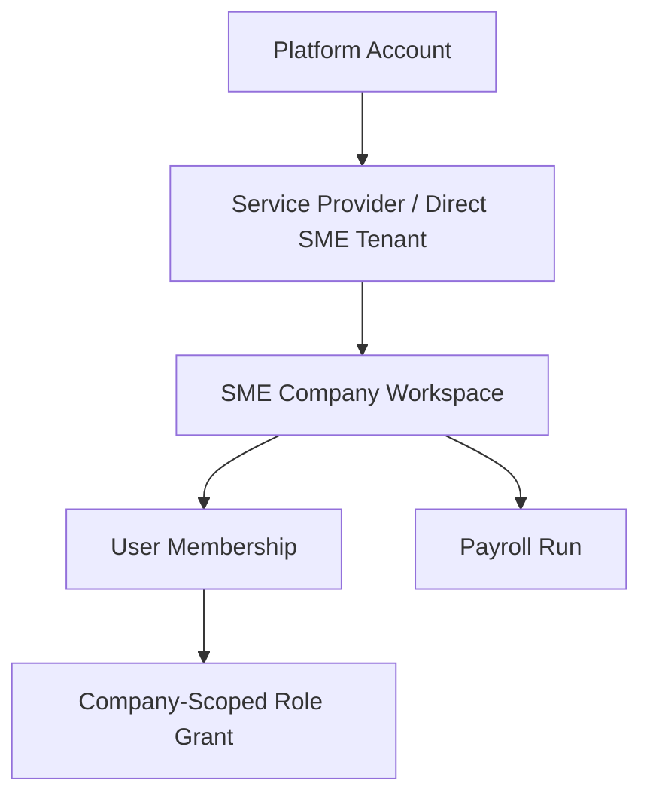

# Tenancy and RBAC Model — SME Payroll Approval SaaS

**Status:** MVP baseline

**Accepted decision:** `DEC-2026-05-17-2331-fixed-mvp-rbac-permission-matrix`

## 1. Purpose

This document defines the MVP tenancy, role, and permission model for a multi-company payroll approval SaaS. The goal is to keep payroll data isolated by company while allowing service-provider style workflows where staff may support multiple SMEs.

MVP chooses fixed role bundles plus an explicit permission matrix. The model must remain future-compatible with tenant-defined custom roles by storing fixed roles as bundles of stable permission keys, not by hardcoding payroll behavior against role names.

## 2. Tenant Hierarchy

## 3. Core Tenancy Rules

- Every business object must belong to a `company_id`.
- Every request must resolve an active `company_id` context before reading or writing payroll data.
- A user can only access a company through an active membership.
- Service-provider users can access only assigned companies, not every company in the tenant by default.
- Platform administrators are operational support users, not silent data owners; sensitive access must require reason capture and audit logging.
- Users may hold multiple fixed roles in the same company when SME responsibilities overlap.

## 4. MVP Roles

Roles are capability bundles, not assumptions that every SME has separate departments. The first MVP can support a solo owner using all capabilities, while still allowing delegation later.

- **Owner / Approver**: owns company workspace, invites users, approves or returns payroll runs, and may perform payroll/payment duties when the SME is small.
- **Payroll Operator**: creates payroll runs, imports rows, resolves validation issues, prepares runs, and submits runs for approval.
- **Payment / Journal User**: exports approved payment files, uploads payment proof, and previews/exports journal handoff files.
- **Auditor / Read-only Reviewer**: views closed payroll runs, evidence packs, and audit timeline according to sensitive-field policy.
- **Platform Admin**: manages support/configuration with restricted, reasoned, audited access.

## 5. Permission Keys

The application should check explicit permission keys. Fixed roles map to these keys through the permission matrix.

- `company.create`
- `company.user.invite`
- `company.role.assign`
- `payroll_run.create`
- `payroll_row.import`
- `payroll_row.edit_draft`
- `payroll_validation.run`
- `payroll_run.submit_for_approval`
- `payroll_run.approve`
- `payroll_run.return_for_correction`
- `sensitive.salary.view`
- `sensitive.bank.view`
- `payment_export.generate`
- `payment_proof.upload`
- `audit_timeline.view`
- `audit_pack.generate`
- `evidence.download`
- `journal_mapping.configure`
- `journal.preview_export`
- `support.break_glass_access`

If a capability is not listed as allowed for a role, it is denied by default.

## 6. Permission Matrix

| Permission key / capability | Owner / Approver | Payroll Operator | Payment / Journal User | Auditor / Read-only Reviewer | Platform Admin |
|---|---:|---:|---:|---:|---:|
| `company.create` — create company workspace | No | No | No | No | Yes |
| `company.user.invite` — invite company users | Yes | No | No | No | Support only |
| `company.role.assign` — assign fixed roles | Yes | No | No | No | Support only |
| `payroll_run.create` — create payroll run | Yes | Yes | No | No | No |
| `payroll_row.import` — import payroll rows | Yes | Yes | No | No | No |
| `payroll_row.edit_draft` — edit rows while Draft / Imported | Yes | Yes | No | No | No |
| `payroll_validation.run` — run validation checklist | Yes | Yes | No | No | No |
| `payroll_run.submit_for_approval` — submit to approver | Yes | Yes | No | No | No |
| `payroll_run.approve` — approve payroll for payment | Yes | No | No | No | No |
| `payroll_run.return_for_correction` — return for correction | Yes | No | No | No | No |
| `sensitive.salary.view` — view salary details/totals | Yes | Yes | Masked unless separately granted | Masked by default | Break-glass only |
| `sensitive.bank.view` — view bank/payment details | Yes | Masked unless separately granted | Yes for approved payment workflow | Masked by default | Break-glass only |
| `payment_export.generate` — export approved payment file | Yes | No | Yes | No | No |
| `payment_proof.upload` — upload payment proof | Yes | No | Yes | No | No |
| `audit_timeline.view` — view audit timeline | Yes | Yes | Yes | Yes | Break-glass only |
| `audit_pack.generate` — generate audit evidence pack | Yes | Yes | Yes | Yes | Break-glass only |
| `evidence.download` — download evidence/proof files | Yes | Conditional | Conditional | Conditional | Break-glass only |
| `journal_mapping.configure` — configure journal mapping | Yes | No | Yes | No | No |
| `journal.preview_export` — preview/export journal handoff | Yes | No | Yes | No | No |
| `support.break_glass_access` — reasoned support access | No | No | No | No | Yes, audited |

## 7. Sensitive Data Controls

Sensitive fields include salary, bank account, identity number, deductions, statutory references, audit packs, and uploaded payment/evidence documents.

Controls:

- Mask sensitive fields by default, including salary, deductions, net pay, bank account, identity references, payment proof, and evidence files.
- Reveal requires active company membership, company assignment where applicable, explicit permission key, valid workflow state, and server-side sensitive-field policy approval (`DEC-2026-05-17-2337-strict-sensitive-data-masking`).
- Owner / Approver and Payroll Operator may see salary data for preparation and approval where granted by the permission matrix.
- Payment / Journal User may see approved bank/payment data only for payment export, proof upload, and journal handoff workflows.
- Auditor / Read-only Reviewer sees masked data unless explicitly granted by role/permission.
- Log every sensitive field reveal/export/download.
- Audit denied attempts for sensitive or lifecycle-changing actions.
- Never include sensitive values in application logs.
- Apply PDPA-aware retention and export controls.
- Customer or tenant feature flags must not disable sensitive-field masking.

## 8. Authorization Invariants

- No payroll action is authorized by UI visibility alone; every API path must enforce server-side policy.
- No payroll run can be approved by a user without active company membership, company assignment, approver permission, and valid payroll state.
- No payroll row can be edited after submission unless the run is returned or reopened through a controlled state transition.
- No payment export is allowed before approval or without `payment_export.generate`.
- No closed payroll run evidence can be silently overwritten; corrections append new events/evidence.
- Platform admin access to customer payroll details requires reason capture and audit event.
- Fixed role names are not authorization logic; the authorization engine evaluates permission keys derived from role grants and state guards.

## 9. API Authorization Pattern

Every protected API should enforce:

1. Authentication: user is signed in.
2. Tenant context: request includes or derives company context.
3. Membership: user belongs to the company.
4. Assignment: service-provider user is assigned to the company where applicable.
5. Permission key: role grants resolve to the required permission key.
6. State guard: payroll run is in a state that allows the action.
7. Sensitive-field policy: salary, bank, identity, evidence, and audit-pack fields are masked or revealed according to explicit permission.
8. Audit: sensitive, denied, or lifecycle-changing action emits an audit event.

## 10. Future Evolution to Custom Roles

Custom roles are intentionally out of MVP, but the data model should not block them later.

Future-compatible design rule:

- Store fixed MVP roles as `FixedRoleBundle(role_code, permission_keys[])`.
- Store assignments as company-scoped `RoleGrant(user_id, company_id, role_code, granted_by, granted_at, status)`.
- Centralize authorization through permission keys and policy/state guards.
- Avoid conditionals such as `if role_name == "Owner"` in payroll, export, or evidence code except inside role-to-permission mapping.

Deferred to Phase 2+:

- Tenant-created custom roles.
- Tenant-facing role builder UI.
- Custom permission editor.
- Role templates marketplace.
- Per-field custom permission editor.
- Complex multi-level approval matrix.
