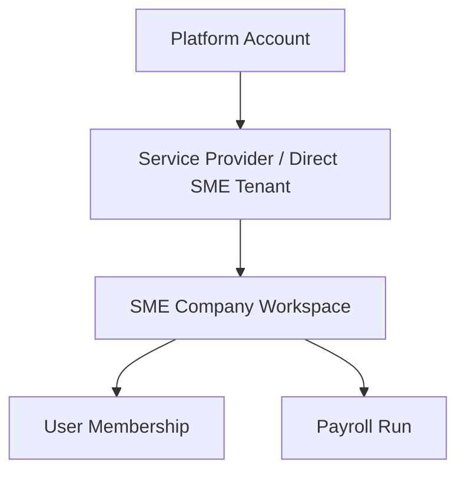

# Tenancy and RBAC Model — SME Payroll Approval SaaS

**Status:** MVP baseline

## 1. Purpose

This document defines the MVP tenancy, role, and permission model for a multi-company payroll approval SaaS. The goal is to keep payroll data isolated by company while allowing service-provider style workflows where staff may support multiple SMEs.

## 2. Tenant Hierarchy

## 3. Core Tenancy Rules

- Every business object must belong to a `company_id`.
- Every request must resolve an active `company_id` context before reading or writing payroll data.
- A user can only access a company through an active membership.
- Service-provider users can access only assigned companies, not every company in the tenant by default.
- Platform administrators are operational support users, not silent data owners; sensitive access must be audited.

## 4. MVP Roles

Roles are capability bundles, not assumptions that every SME has separate departments. The first MVP can support a solo owner using all capabilities, while still allowing delegation later.

- **Owner / Approver**: owns company workspace, invites users, approves or rejects payroll runs.
- **Payroll Operator**: creates payroll runs, imports rows, resolves validation issues, prepares runs for approval. This may be the SME owner in a solo/small company setup.
- **Payment / Journal User**: optional role for exporting payment files, uploading payment proof, and viewing journal preview/export. In many SMEs this may be the same person as the owner or payroll operator.
- **Auditor / Read-only Reviewer**: views closed payroll runs, evidence packs, and audit timeline.
- **Platform Admin**: manages support/configuration with restricted and audited access.

## 5. Permission Matrix

| Capability | Owner | Payroll Operator | Payment / Journal User | Auditor | Platform Admin |
|---|---:|---:|---:|---:|---:|
| Create company workspace | Yes | No | No | No | Support only |
| Invite company users | Yes | No | No | No | Support only |
| Create payroll run | Yes | Yes | No | No | No |
| Import/manual edit payroll rows | Yes | Yes | No | No | No |
| View salary/bank details | Yes | Conditional | Conditional | Masked by default | Break-glass only |
| Submit for approval | Yes | Yes | No | No | No |
| Approve payroll run | Yes | No | No | No | No |
| Reject/return payroll run | Yes | No | No | No | No |
| Export payment file | Yes | No | Yes | No | No |
| Upload payment proof | Yes | No | Yes | No | No |
| View audit pack | Yes | Yes | Yes | Yes | Break-glass only |
| Reopen closed run | Yes | No | No | No | Support only |

## 6. Sensitive Data Controls

Sensitive fields include salary, bank account, identity number, deductions, statutory references, and uploaded payment/evidence documents.

Controls:

- Mask sensitive fields by default where full value is not required.
- Require explicit permission for full salary/bank visibility.
- Log every sensitive field reveal/export.
- Never include sensitive values in application logs.
- Apply PDPA-aware retention and export controls.

## 7. Authorization Invariants

- No payroll run can be approved by a user without active company membership and approver permission.
- No payroll row can be edited after submission unless the run is returned or reopened through a controlled state transition.
- No payment export is allowed before approval.
- No closed payroll run evidence can be silently overwritten; corrections append new events/evidence.
- Platform admin access to customer payroll details requires a reason and audit event.

## 8. API Authorization Pattern

Every protected API should enforce:

1. Authentication: user is signed in.
2. Tenant context: request includes/derives company context.
3. Membership: user belongs to company.
4. Role/policy: user has permission for the action.
5. State guard: payroll run is in a state that allows the action.
6. Audit: sensitive or lifecycle-changing action emits an audit event.

